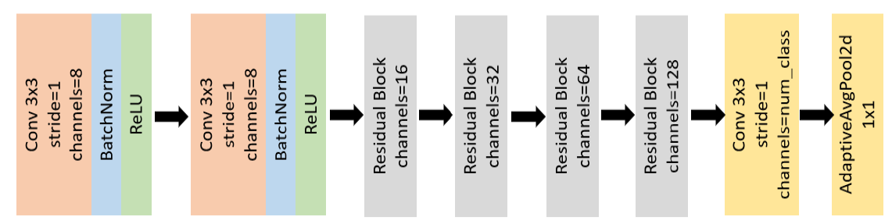

# Facial Emotion Recognition 

Human computer interaction has gained significant momentum in last few years. Human facial expression is a powerful tool in inter human interactions. Aiming to procure the information related to the state of mind, motivation of the subject, etc. there has been a lot of research in the area of automatic facial expression recognition. We will implement the Xception architecture for detecting emotions and understand its efficacy as an image recognition pipeline. We will make use of the Facial Expression Recognition (FER2013) dataset. The dataset consists of 35,685 examples of 48x48 pixel grayscale images of faces. Images are categorized based on the emotion shown in the facial expressions (happiness, neutral, sadness, anger, surprise, disgust, fear).  

The repository contains following folders and files-  
* [dataset][dataset]- The folder contains FER2013 dataset as a single `.csv` file.
* `train.py`, `model.py` and `check.py` are used to implement and improve the Xception model.
* `visualize`- The folder contains `grad_cam.py` for visula XAI and `haarcascade_frontalface_default.xml` for frontal face detection.

Figure above presents the Xception model for emotion recognition on FER2013 dataset. `model.py` contains the implementation of this architecture.

[dataset]: https://drive.google.com/drive/folders/1sflMPpaeoECBWLOJbP9AFefUGoD336en?usp=sharing
